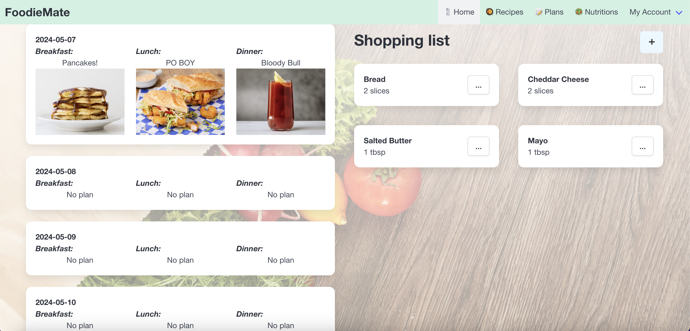
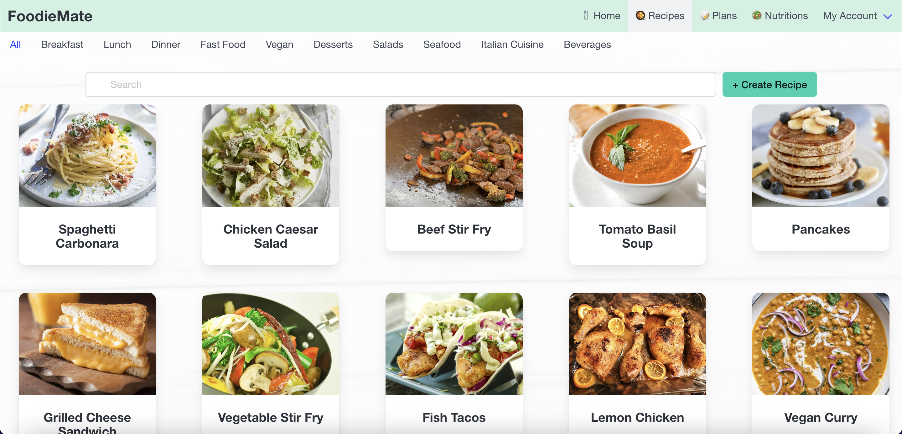
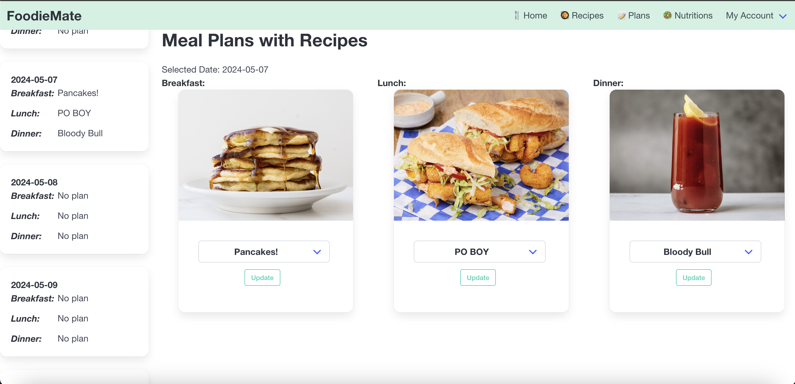
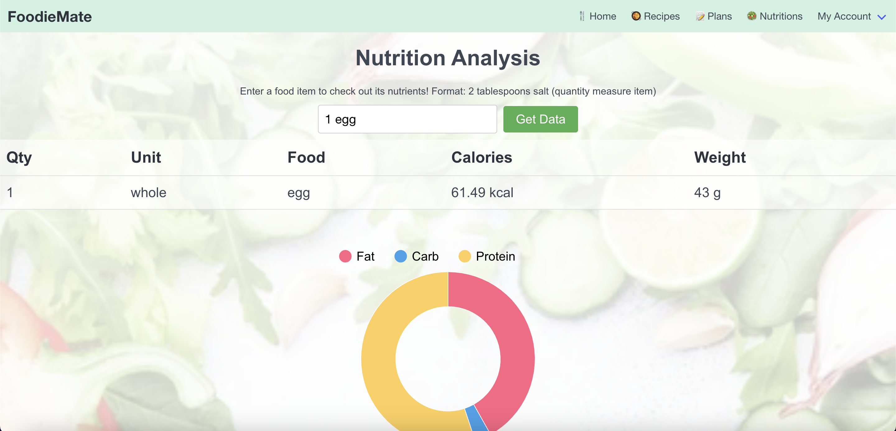
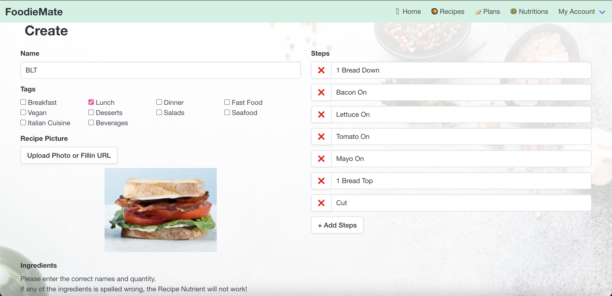
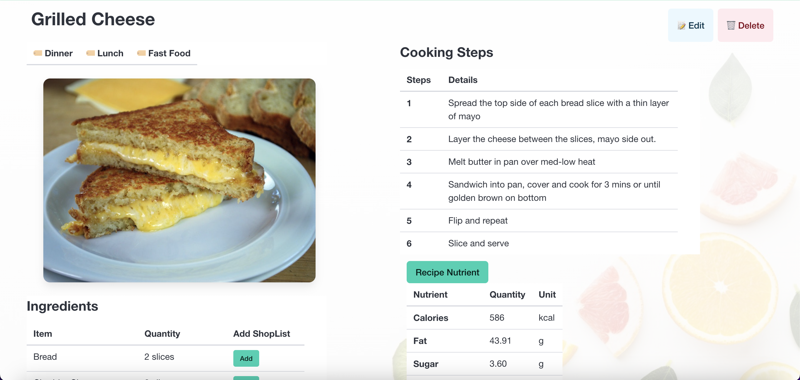

# Module 2 Group Assignment

CSCI 5117, Spring 2024, [assignment description](https://canvas.umn.edu/courses/413159/pages/project-2)

## App Info:

* Team Name: Delulu
* App Name: FoodieMate
* App Link: <[FoodieMate](https://purple-coast-041010610.5.azurestaticapps.net/)>

### Students

* Hannah Cheng, cheng861@umn.edu
* Lingyi Xu, xu001032@umn.edu
* Yuankun Jiao, jiao0052@umn.edu
* David Mai, mai00048@umn.edu
* Jimmy Xiao, xiao0261@umn.edu

## Key Features

**Describe the most challenging features you implemented
(one sentence per bullet, maximum 4 bullets):**

* Mealplanner to designate recipe plans for current and future days and for different meal times.

* Nutrition calculator and integration with recipes. 

* Cloudinary image upload and storing for recipes. 

**Which (if any) device integration(s) does your app support?**

* Our app supports camera integration through the Cloudinary Widget.

**Which (if any) progressive web app feature(s) does your app support?**

* Our app supports Home Screen Installs to download the app to the device. 

## Mockup images

### Not log home page
<!--  -->

### User home page

### Recipe home page

### Create recipe page

### About recipe page

### Plans page

## Testing Notes

**Is there anything special we need to know in order to effectively test your app? (optional):**

* N/A

## Screenshots of Site (complete)

### Home Page
User shopping list and static display of meal plans.

### Recipes Page
View user's recipes under different categories along with a search. Can create new recipes from here or click on recipes to view details.

### Plans Page
Set mealplans using your recipes here. Can set breakfast/lunch/dinner for future days.

### Nutrition Page
Nutrition tool to get information on ingredients. Comes with table and graph information.

### Recipe Create
Create page for new recipes. Set names, tags, steps, ingredients, images. Image upload can be done using device camera.

### Recipe Details
Page for each recipe. Shows name, tags, steps, ingredients, and an image of the item (if provided). Also option to view nutrients of recipe given the ingredients. Can edit or delete recipe from this page.

## External Dependencies

**Document integrations with 3rd Party code or services here:**

* Bulma CSS: Page styling
* Cloudinary: Image uploading and storing
* (React) Google Charts: Nutrition Charts
* Edamam: Nutrition API
* Axios: Fetch requests for Nutrition API

**If there's anything else you would like to disclose about how your project
relied on external code, expertise, or anything else, please disclose that
here:**

* Referenced the Cloudinary tech share for Cloudinary widget and image uploads.

...
